# Background & Gradient

### Background

Background plays a significant role when designing a website. They help us to differentiate between sections, group contents, build a hierarchy, etc on a page.

We are going to look at the properties specific to the background that CSS offers. Within CSS an element can have a solid background color, gradient, or even an image. Let's see how we can implement different types of backgrounds.

#### background-color

To add a single solid color background the `background-color` or `background` property can be used. The `background-color` property will only add color whereas `background` property is shorthand for both colors as well as image. So you can use any of these two properties to background color.

```css
  div {
    background-color: #0f0;
  }
```

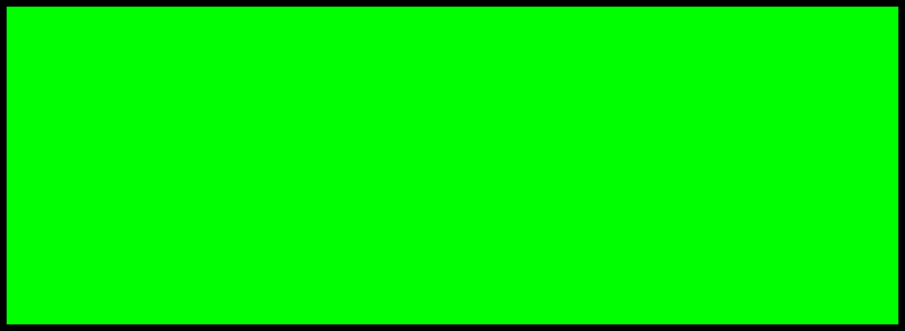

All the general values of color can be used for the `background-color`, keyword, hexadecimal codes, RGB, RGBa, HSL, and HSLa values. Most commonly you can see are hexadecimal codes.

To add a transparent color we can use RGBa or HSLa values, and we have already seen how these values work in the chapter ["Getting to Know More About HTML & CSS"](https://github.com/AltCampus/AC-STYLE-getting-to-know-more-about-html-and-css).

#### Adding Background Image

To add a background image for an element `background-image` or `background` property can be used. No matter which property you use the value will be `URL()` function to identify the source of an image.

```css
  div {
    background-image: url("pattern.png");
  }
```

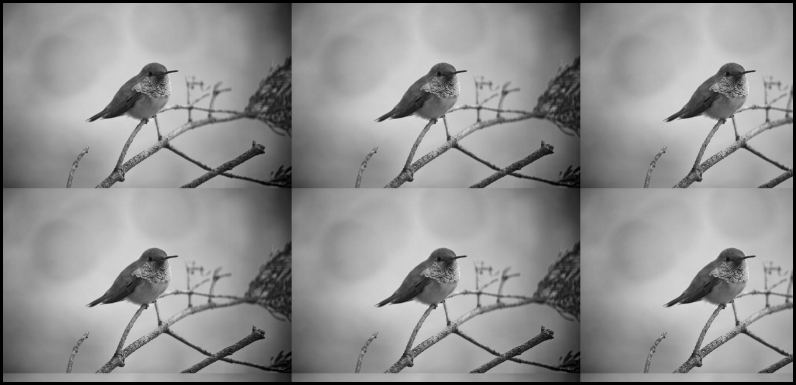

The `URL()` value allows to provide a file path to any image, that will show in the element's background. Keep an eye while providing the path inside the `URL()` function because if the path of the file will be wrong, the image won't show up.

> One more important point to keep in mind that if the element doesn't have any content inside it and there is no height to the element, the background image won't show up.
> The background image is entirely different from the `img` HTML element, it's a style not a type of content of your page.
> If an image is part of your content then use the `img` element in the HTML document.

When adding a background image there are few other things also you need to take care of. Because, commonly, you may not get the desired result using only `background-image`. For example, by default, the background image will repeat horizontally as well as vertically to fill up the whole element's background. To remedy this behaviour CSS offers `background-repeat` and `background-position` property in addition to `background-image`.

##### Background Repeat

The background-repeat property accepts four different values: `repeat`, `repeat-x`, `repeat-y`, and `no-repeat`.

The `repeat` value is the default one, that's why image repeat horizontally and vertically. However, with `no-repeat` value the image stops repeating. You will see only once for the whole element's background.

```css
  div {
    background-image: url("pattern.png");
    background-repeat: no-repeat;
  }
```

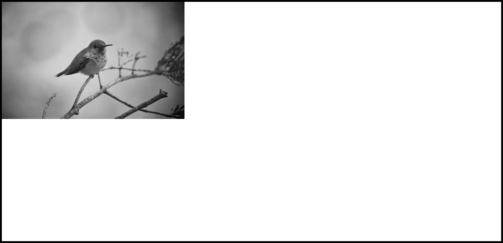

The `repeat-x` value will repeat the background image horizontally and `repeat-y` value will repeat the background image vertically.

```css
  div {
    background-image: url("pattern.png");
    background-repeat: repeat-x;
  }
```

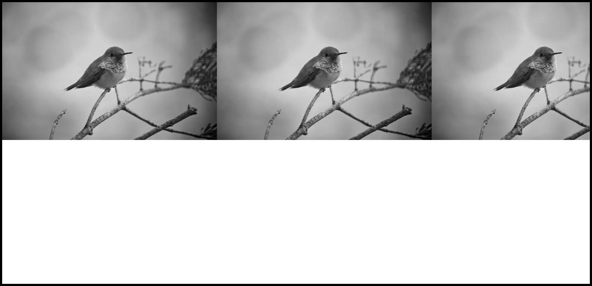

```css
  div {
    background-image: url("pattern.png");
    background-repeat: repeat-y;
  }
```

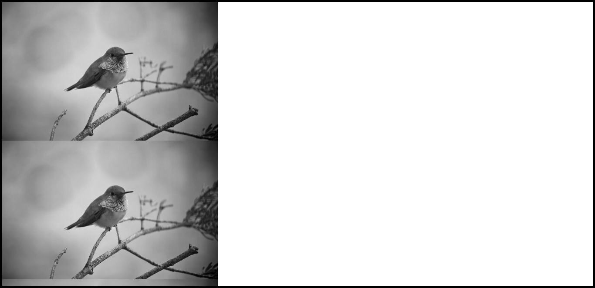

#### Background Position

You can also alter the position of the background image using `background-position` property. By default, the background images are positioned at the left top corner of the element.

```css
  div {
    background-image: url("pattern.png");
    background-repeat: no-repeat;
    background-position: 100px 50%;
  }
```

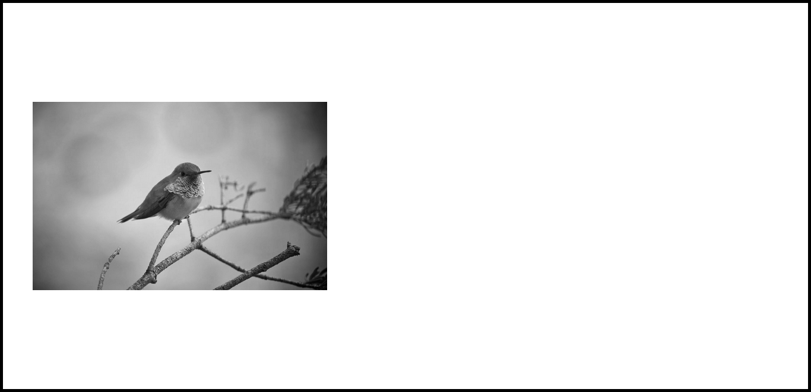

The `background-property` accepts two values at a time, the first value is for horizontal offset, and the second is for vertical offset. If only one value is specified then the second value will be 50% by default.

The values can be all general length values and some keyword values. The keyword values are, `top`, `right`, `bottom`, `right`, and `center`.


The `left` `top` or `0` `0` value will position the background image at the left top corner and `right` `bottom` or `100%` `100%` will position the image in the right bottom corner of the element.

##### Shorthand Background Property

Within CSS there is a shorthand `background` property, that allows us to implement all these properties at once.

```css
  div {
    background: #bada55 url("pattern.png") 16px 50% no-repeat.
  }
```

The first value is for `background-color`, second for `background-image`, third and fourth for `background-position`, and last is for `background-repeat`.

It recommended that while using background image shorthand property always provides a fallback background-color. In case, the image is not displayed, the color will display in the background.

Apart from all these background properties in there is one more new property `background-size` property to control the size of the background image.

##### Background Size Property

The `background-size` property allows us to specify the size of the background image, which accepts all the general length and few keyword values.

Using the length values we can set the width and height of the background image with space-separated.

```css
  div {
    background: url("pattern.jpg") 0 0 no-repeat;
    background-size: 400px 300px;
  }
```

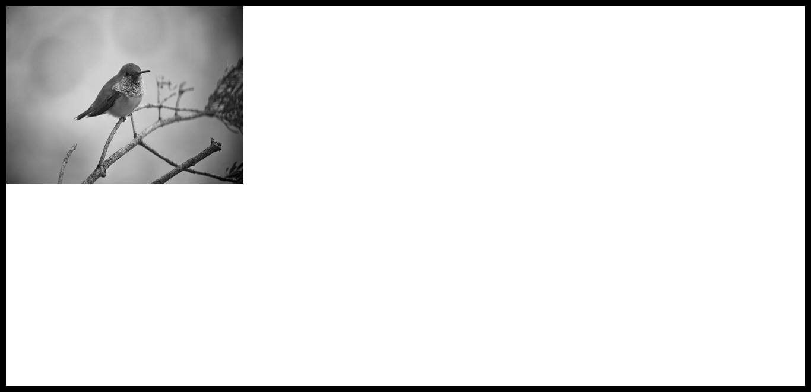

The first value specifies the width and the second value specifies the height of the image. Specifying only one value will set the width of the background image and height will be auto to preserve the aspect ratio. The `auto` value can be used for any of the width and height to preserve the aspect ratio of the image.

> If you are using percentage value just keep in mind that it will be in relation to the element's size not the background image's size.

> It not work for `background-image` not for `background-color`

*Cover & Contain Keyword Values*

The `background-size` property accepts two other keyword values: `cover` and `contain` to control the size of the background image.

Using the `cover` value will **resize the image to cover the element's background**(height and width) completely. The image will stretch or shrink to cover entirely but the aspect ratio of the image will be preserved.

Commonly, some parts of the background image cut off to occupy the full space of the element.

```css
  div {
    background: url("pattern.jpg") 0 0 no-repeat;
    background-size: cover;
  }
```


The `contain` value will also **resize the image to reside inside the width and height of the element**. Here also the aspect ratio of the image will be preserved, but the image will shrink or stretch to remain within the width and height of the element.

Using contain value it is common to find that the whole element's size is not covered by the background image, though you will always full background image.

```css
  div {
    background: url("pattern.jpg") 0 0 no-repeat;
    background-size: contain;
  }
```

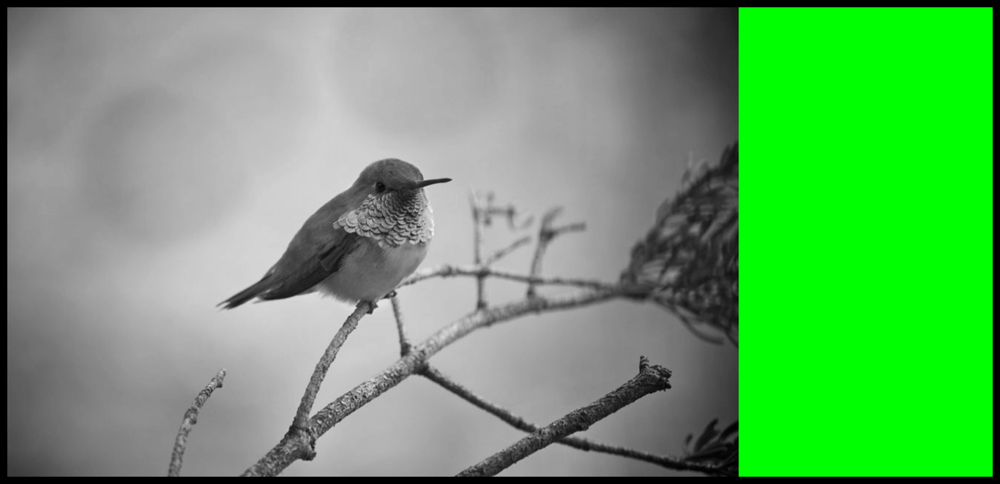

Sometime you may get confused with these two values. Always remember the `cover` value will resize the background image to occupy the whole space of the element including width and height. While the `contain` value will resize the background image to be within the width and height of the element. In cover value, you may not see a full background image, but in contain value, you will see the full background image.

#### background-origin

The background-origin CSS property sets the background's origin: from the border start, inside the border, or inside the padding.

```css
  div {
    background: url("pattern.jpg") 0 0 no-repeat;
    border: 10px dashed #000;
    background-origin: border-box;
  }
```


padding-box - The background is positioned relative to the padding box.

content-box - The background is positioned relative to the content box.

#### background-clip

The background-clip CSS property sets whether an element's background extends underneath its border box, padding box, or content box.

border-box - The background extends to the outside edge of the border (but underneath the border in z-ordering).

```css
div {
    border: 10px dashed #000;
    background-clip: border-box;
}
```


padding-box - The background extends to the outside edge of the padding. No background is drawn beneath the border.

```css
div {
    border: 10px dashed #000;
    background-clip: padding-box;
}
```

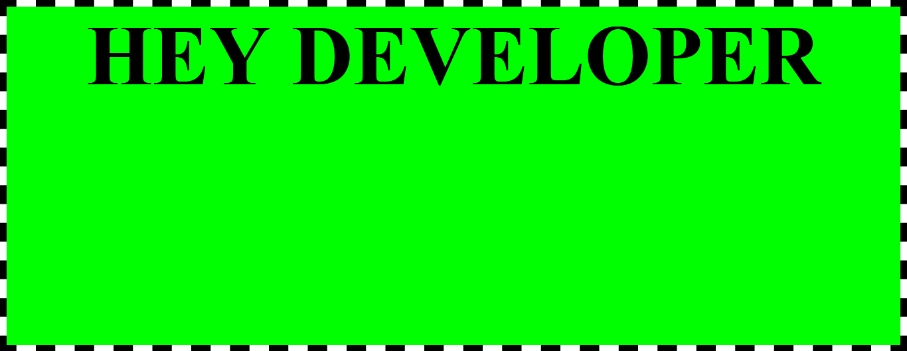

content-box - The background is painted within (clipped to) the content box.

```css
div {
    border: 10px dashed #000;
    padding: 20px;
    background-clip: content-box;
}
```


text - The background is painted within (clipped to) the foreground text. (Experimental)

```css
div {
    border: 10px dashed #000;
    background-clip: text;
    -webkit-background-clip: text;
    color: transparent;
}
```


#### Background-attachment

The background-attachment property sets whether a background image scrolls with the rest of the page, or is fixed.

```css
div {
  background-attachment: scroll (Default)|fixed|local|initial|inherit;
}
```

### CSS Gradient

Just like the way solid background color can be applied to elements in CSS, similarly, we can also apply gradient background. Gradients are typically one color that fades into other colors.

Within CSS gradients are treated as the background image. Therefore to apply a gradient background `background-image` or `background` property can be used. CSS allows us to apply two types of the gradient: `linear-gradient` and `radial-gradient`.

##### Linear Gradient Background

Linear gradient can be applied using `linear-gradient()` function within the `background` or `background-image` property.

```css
  .div {
    background-image: linear-gradient(#4747df, #00ccff);
  }
```

The `linear-gradient()` function must have two or more than two colors. The first value will be the beginning color and the last value will be the ending color value. In the middle somewhere the browser will handle the transition between the colors.

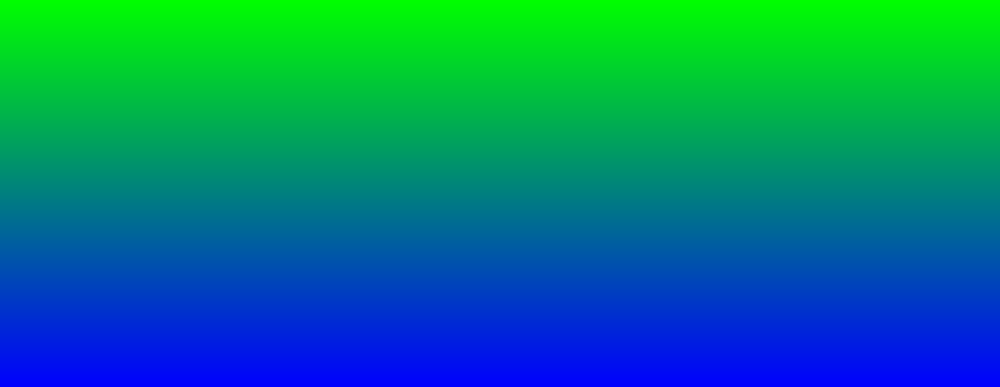

By default, the linear gradient background colors will move top to bottom within an element. However, you can control the direction of the colors.

**Controlling the Direction of Gradient**

Keyword or degree values are applied before the color values to change the direction of linear-gradient background colors.

If you want to move the colors from left to right, `to right` value can be stated before the color values. From top to bottom you can apply `to bottom`, that's a default direction of `linear-gradient` background.

```css
  .div {
    background-image: linear-gradient(to right, #4747df, #00ccff);
  }
```


The keyword values can also be combined. We can also move colors from one corner to another corner(diagonally) of the element. For example, if we want to move the color from top to right bottom of an element, we can apply `to right bottom` value.

```css
  .div {
    background-image: linear-gradient(to top right, #4747df, #00ccff);
  }
```


However, if the element is not an exact square then you may not find the colors moving exactly from one corner to another.

Besides the keyword values, we can also apply values in degree. With degree values, we can have better control over the linear-gradient direction. For example, the above direction value can be replaced with `45deg`, but this time the color will move diagonally exactly.

```css
  .div {
    background-image: linear-gradient(45deg, #4747df, #0f0);
  }
```


The degree value is also based on the same concept that we all know, `0` through `360`.

If you want to learn more gradient how these degree values or keyword values go through the article [“Linear Gradient Keywords”.](http://meyerweb.com/eric/thoughts/2012/04/26/lineargradient-keywords/) of Eric Meyer.

**Gradient Color Stop**

At a minimum, gradient backgrounds will transition from one color to another; however, we may add multiple colors to a gradient and have the browser transition between all of them. To do this we’ll add color stops to the given gradient function, with commas separating each color stop from the next.

```css
div {
  background: linear-gradient(to right, #f00, #0f0, #0f0);
}
```

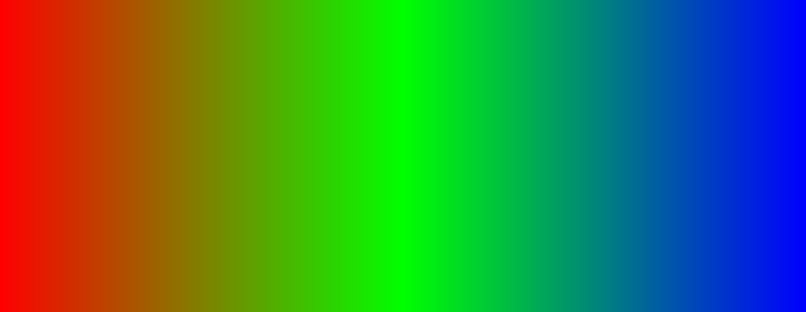

By default, the browser will position every color stop an equal distance from the next and will transition between them accordingly.

If more control over how colors are positioned is desired, a location along the gradient may be identified for each color stop. The location should be declared as a length value and should fall after the color value.

```css
div {
  background: linear-gradient(to right, #f00 60%, #0f0, #0f0);
}
```

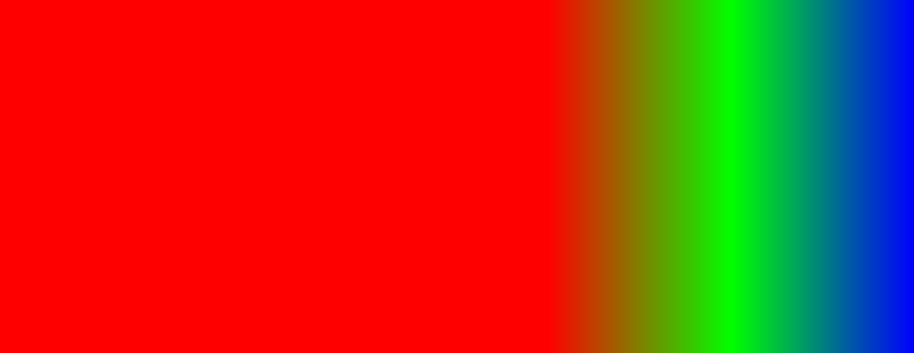

**Creating Hard Lines**

To create a hard line between two colors, creating a stripe instead of a gradual transition, adjacent color stops can be set to the same location

```css
div {
  background: linear-gradient(to right, #f00 50%, #0f0 50%);
}
```
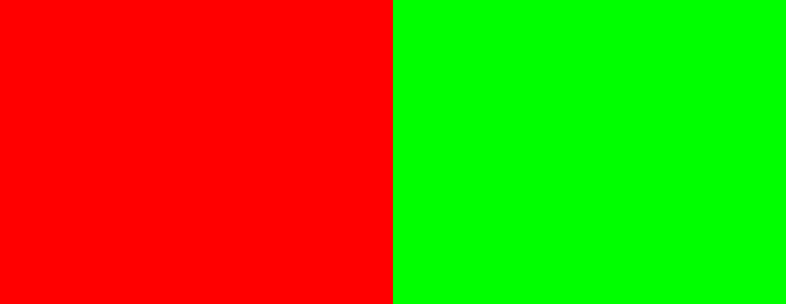

**Creating color bands**

You can refer [MDN Linear Gradient](https://developer.mozilla.org/en-US/docs/Web/CSS/CSS_Images/Using_CSS_gradients) for Better Understanding.

```css
.multiposition-stops { 
   background: linear-gradient(to right, 
       lime 20%, red 30%, red 45%, cyan 55%, cyan 70%, yellow 80% );  
   background: linear-gradient(to right, 
       lime 20%, red 30% 45%, cyan 55% 70%, yellow 80% ); 
}
```

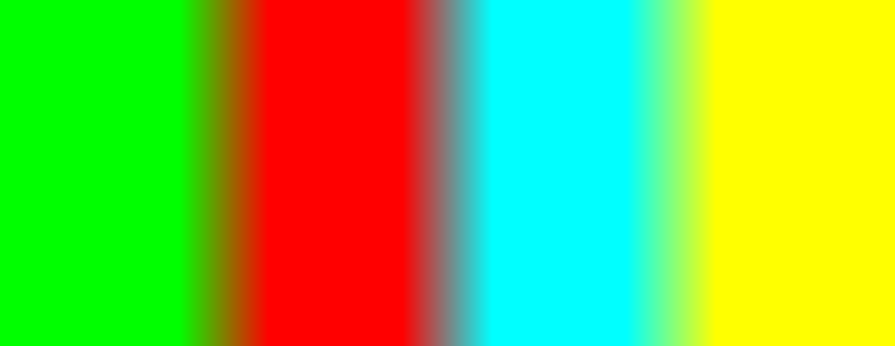

Above both `background` value are same. Here is what happeing is the lime goes from the 0% mark, which is implied, to the 20% mark, transitions from lime to red over the next 10% of the width of the gradient, reach solid red at the 30% mark, and staying solid red up until 45% through the gradient, where it fades to cyan, being fully cyan for 15% of the gradient, and so on.

**Solid Color Stripes**

```css
div {
    background: linear-gradient(to left, 
      lime 25%, red 25%, red 50%, cyan 50%, cyan 75%, yellow 75% );
    background: linear-gradient(to left, 
      lime 25%, red 25% 50%, cyan 50% 75%, yellow 75% );
}
```

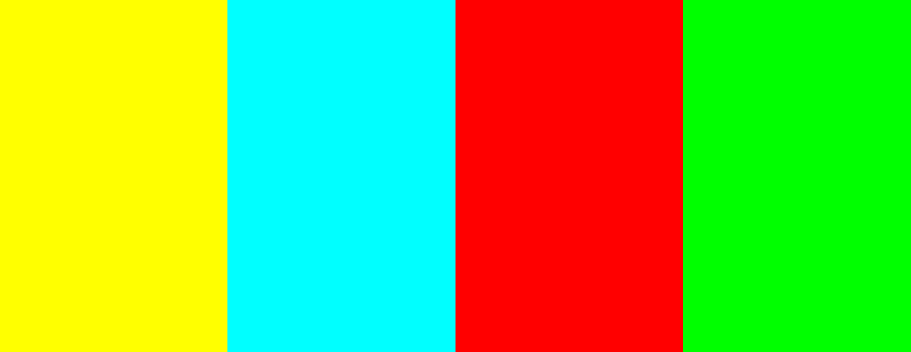

The second color stop for each color is at the same location as the first color stop for the adjacent color, creating a striped effect.

In both examples, the gradient is written twice: the first is the CSS Images Level 3 method of repeating the color for each stop and the second example is the CSS Images Level 4 multiple color stop method of including two color-stop-lengths in a linear-color-stop declaration.

##### Radial Gradient Background

Like `linear-gradient`, there is `radial-gradient` background also in CSS where color moves radially. It can be applied using the `radial-gradient()` function, with the same values as we have applied in `linear-gradient`.

```css
div {
    background-image: radial-gradient(#f00, #0f0);
  }
```

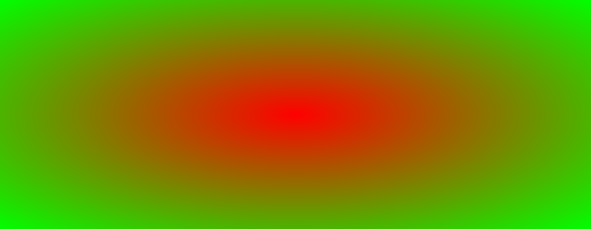

Multiple color values can also be applied, where the first value will sit absolutely in the center of the element and the last value will sit towards the outside of the element. The browser will then create a transition between the colors.

#### Multiple Background Images

In the past, we could apply only one background image at a time. But in CSS3 multiple background image concept has been introduced on an element. With comma separated we can apply multiple background images within `background` or `background-image` property.

```css
div {
    background: url(./images2.jpg) 0 0 no-repeat, url(./image.png) 0 0 no-repeat;
}
```

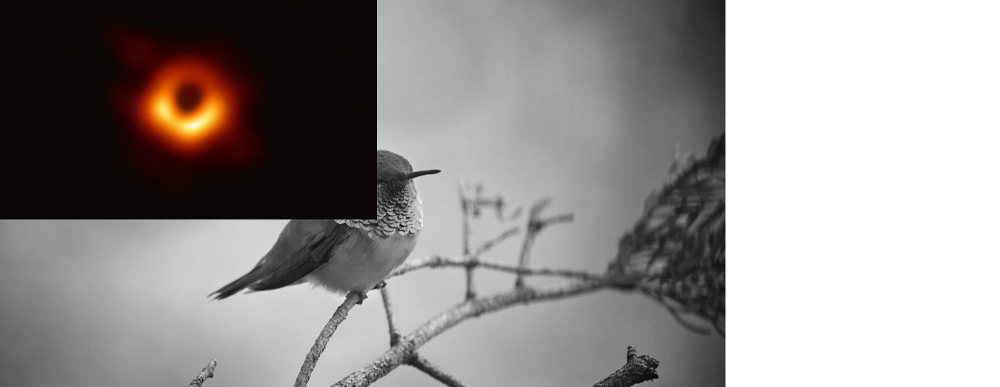

The first value will be the foremost background image and the last value will the rearmost background image. The value between first and last will sit between the foremost and rearmost background image.

> Note here I used alpha value if not used it will hideout entire Images with linear-gradient colors.

The multiple background concept is with images only. You cannot combine the `background-color` and `background-image` at the same time.

However, we can apply color and image both in the background at the same time on any element.

```css
div {
    background: linear-gradient(to right, rgba(0, 255, 0 , 0.2), rgba(0, 0, 255 , 0.2)), url(./image.png) 0 0 no-repeat;
    background-size: cover;
}
```


Instead of applying just one background color, and background image, use the concept of the background image. The gradient is also a type of background image and keeps both values of color the same.